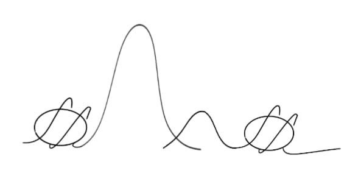

# PyFragLib



## Overview

`pyfraglib` is a Python library to analyze high-throughput sequencing data of
cell-free DNA (cfDNA). More specifically, it facilitates the investigation of
fragmentomics features of which a list can be found below.

Because fragmentation of cfDNA is non-random, tissue- and disease-specific
patterns emerge in e.g. fragment length or end motif distributions. To date,
no comprehensive tool exists to implement a "fragmentomics workflow".
`pyfraglib` aims at being such at tool.

## Installation

It is recommended that `pyfraglib` is installed into a dedicated conda
environment using `pip`, the Python package manager:

```bash
git clone git@bitbucket.org:schwarzlab/project-lymphoma-cfdna.git
cd pyfraglib
conda env create -f pyfraglib.yml
conda activate pyfraglib
python3 -m pip install .
```

During development, all code in `pyfraglib` is thoroughly type-checked using
`mypy`. After an initial installation as described above, do:

```bash
./tools/dev_install.sh # typing & linting errors are reported
```

As soon as `pyfraglib` is available through PyPI, installation will be even
easier (no need to clone the repo then).

## Usage

`pyfraglib` comes with a command line utility. After successful installation,
it can be used as follows:

```bash
pyfrag.py version # show currently installed version
pyfrag.py --help # show available subcommands and flags
```

`tools/workflow.sh` gives an example of a commonly used sequence of commands.

## Pipeline

`pyfraglib` offers a simple batch mode for most operations, i.e. it can take
a directory of BAM or FRAG files and perform analyses on them. Some operations
(i.e. the `extract` subcommand) are even parallelized. We explicitly do not
recommend using this functionality for the analysis of large cohorts. Even 10
BAM files cannot be extracted at once without exceeding most workstation's
memory. Thus, we include a convenient Nextflow pipeline in `tools/pipeline.nf`.
It reads the input data from a TSV file and Nextflow parallelizes `pyfraglib`s
operations as much as possible. See `tools/nextflow.config` for all paths and
variables that must be set by the user. Currently, only `slurm` is supported as
a scheduler (via the `ramses` profile).

## Implemented Algorithms

| Fragmentomics Feature                    | Related Publication                 | Impl. Status  |
|------------------------------------------|-------------------------------------|---------------|
| Fragment length analysis                 |                                     | in progress   |
| K-mer end motifs 3'/5'                   |                                     | in progress   |
| Motif diversity score                    |                                     | in progress   |
| Window protection score                  |                                     | in progress   |
| D/U fragment ends ("OCF")                | Sun et al., Genome Research, 2019   | not yet       |
| NMF-derived fragment length signatures   | Renaud et al., Elife, 2022          | not yet       |
| DELFI Metric (short / long fragments)    | Cristiano et al., Nature 2019       | not yet       |
| Maximum nucleosome protection            | Snyder et al., 2016                 | not planned   |
| 2k- & NDR-TSS coverage metrics           | Ulz et al., Nature Genetics 2016    | not planned   |
| Promoter fragmentation entropy           |                                     | not planned   |

## Citation

As long as `pyfraglib` is not published, please cite this repository if you use it in your scientific work.

## License
`pyfraglib` is licensed under the GPL-v3 as indicated in the source files.
Please direct requests to <daniel.schuette@iccb-cologne.org>.

