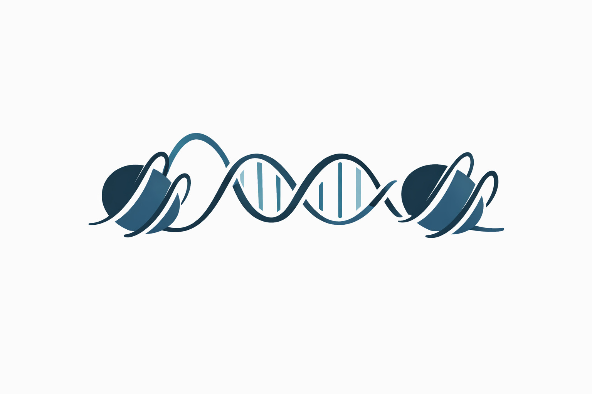

pyfraglib Documentation
=======================

``pyfraglib`` is a Python library for analyzing high-throughput sequencing data of cell-free DNA (cfDNA), focusing on fragmentomics features. It provides tools to extract, analyze, and visualize fragment characteristics -- either starting from BAM files or using a custom, memory-efficient file format.

.. toctree::
   :maxdepth: 2
   :caption: Contents:

   installation
   quickstart
   cli/index
   api/index
   simulation/index
   examples/index
   contributing
   changelog

Indices and Tables
==================

* :ref:`genindex`
* :ref:`modindex`
* :ref:`search`
