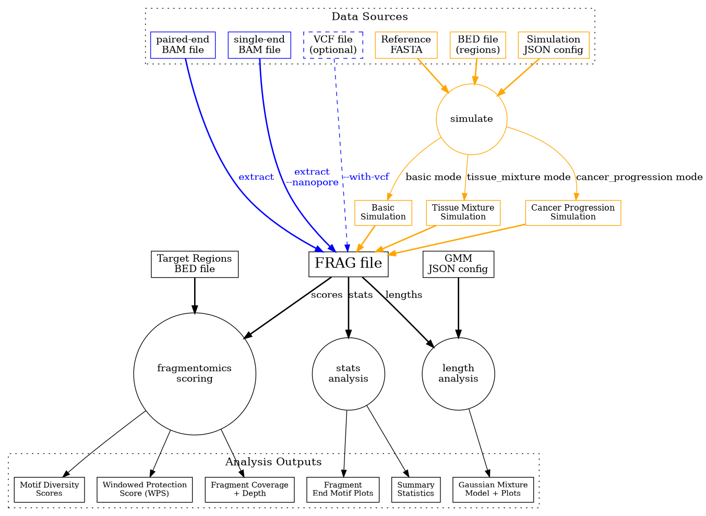

Quick Start Guide
=================

This guide will help you get started with ``pyfraglib``. We'll cover the basic workflow from BAM file processing to generating fragmentomics analyses. Please let us know if you think that this page is missing important information!

Basic Workflow
--------------

The typical pyfraglib workflow involves:

1. **Extract fragments** from BAM files
2. **Analyze fragment characteristics** (lengths, motifs, etc.)
3. **Calculate fragmentomics scores** (WPS, motif diversity)
4. **Visualize results** with plots and statistics

Command Line Interface
----------------------

``pyfraglib`` provides a command-line interface through the ``pyfrag.py`` script that lets you perform these tasks in a few commands:

Extract Fragments
~~~~~~~~~~~~~~~~~

.. code-block:: bash

   # Extract from single BAM file
   pyfrag.py -o fragments/ extract --bam-file sample.bam

   # Include mutation annotation (BAM and VCF file names must match!)
   pyfrag.py -o fragments/ extract --bam-file sample.bam --with-vcf

Generate Overview Statistics
~~~~~~~~~~~~~~~~~~~~~~~~~~~~

.. code-block:: bash

   pyfrag.py -o stats/ stats --frag-file sample.frag

Analyze Fragment Lengths
~~~~~~~~~~~~~~~~~~~~~~~~~

.. code-block:: bash

   pyfrag.py -o lengths/ lengths --frag-file sample.frag --config-file configs/gmm_3.json

Calculate Fragmentomics Scores
~~~~~~~~~~~~~~~~~~~~~~~~~~~~~~~

.. code-block:: bash

   pyfrag.py -o scores/ scores --frag-file sample.frag --bed-file regions.bed

Python API
----------

You can also use ``pyfraglib`` programmatically and thus implement custom workflows easily:

Fragment Extraction
~~~~~~~~~~~~~~~~~~~

.. code-block:: python

   from pyfraglib import Fragment

   # Extract fragments from BAM file
   fragments = Fragment.from_bam("sample.bam")

   # With VCF annotation
   fragments = Fragment.from_bam("sample.bam", "variants.vcf")

   # Save to fragment file
   fragments.to_frag_file("sample", "output_directory")

Fragment Analysis
~~~~~~~~~~~~~~~~~

.. code-block:: python

   from pyfraglib import FragFile

   # Load fragment file
   frag_file = FragFile("sample.frag")
   fragments = frag_file.get_fragment_list()

   # Basic statistics
   print(f"Total fragments: {fragments.length()}")
   print(f"Bogus fragments: {fragments.count_bogus_fragments()}")
   print(f"Mutated fragments: {fragments.count_mutated_fragments()}")

   # End motif analysis
   motifs_5p, motifs_3p, num_frags = fragments.count_endmotifs(4)
   print(f"Most common 5' motif: {max(motifs_5p, key=motifs_5p.get)}")

Length Distribution Analysis
~~~~~~~~~~~~~~~~~~~~~~~~~~~~

.. code-block:: python

   from pyfraglib import fit_gmm, plot_gmm

   # Extract fragment lengths
   lengths = [frag.length for frag in fragments if not frag.is_bogus]

   # Fit Gaussian mixture model
   gmm_result = fit_gmm(lengths, n_components=3)

   # Plot results
   plot_gmm(lengths, gmm_result, "length_distribution.png")

Fragmentomics Scores
~~~~~~~~~~~~~~~~~~~~

.. code-block:: python

   from pyfraglib.scores import windowed_protection_score

   # Calculate WPS for genomic regions
   bed_regions = [("chr1", 1000, 2000), ("chr1", 5000, 6000)]
   wps_scores = windowed_protection_score(fragments, bed_regions)

Simulation
----------

A key features of ``pyfraglib`` is its simulation module. You can generate synthetic cfDNA data like so:

.. code-block:: python

   from pyfraglib import FragmentSimulator
   from pyfraglib.simulator.fragment_simulator import SequenceContextGenerator

   # Create sequence generator and simulator
   seq_gen = SequenceContextGenerator("reference.fasta")
   simulator = FragmentSimulator(seq_gen)

   # Define regions to simulate
   regions = [("chr1", 1000000, 2000000)]

   # Generate fragments
   fragments = simulator.simulate_fragments(regions, num_fragments=10000)

   # Save results
   fragments.to_frag_file("synthetic_sample", "output/")

Working with Configuration Files
--------------------------------

pyfraglib uses JSON configuration files for various analyses. Examples can be found in the ``configs/`` directory of the repository as well as in the API documentation.

Next Steps
----------

Please refer to the :doc:`api/index` documentation for detailed API reference. CLI usage is explained here :doc:`cli/index` with a reference of all available command-line options. Lastly, you can learn about :doc:`simulation/index` for generating synthetic data.

