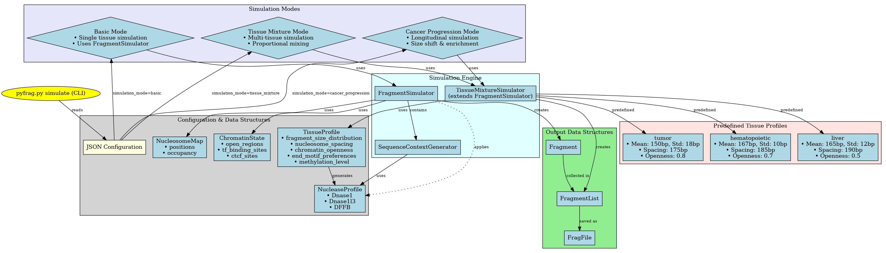

Simulation
==========

``pyfraglib`` includes a simulation module for generating synthetic cfDNA data. This is useful for testing algorithms, validating methods, and creating benchmarking datasets.

Overview
--------

Simulations are based on the biological processes that underlie DNA fragmentation and shedding into the blood stream. The API reference explains the assumptions (and the scientific references) in greater detail. The simulation module provides different simulation modes (see below). All simulations use genomic sequences from FASTA files to generate realistic fragment end motifs and maintain biological accuracy to a certain degree.

The API integrates with the rest of the ``pyfraglib`` ecosystem:

.. code-block:: python

   from pyfraglib import FragmentSimulator
   from pyfraglib.simulator.fragment_simulator import SequenceContextGenerator

   seq_gen = SequenceContextGenerator("reference.fasta")
   simulator = FragmentSimulator(seq_gen)

   fragments = simulator.simulate_fragments(
       chrom="chr1", start=1_000_000, end=1_100_000,
       num_fragments=10000
   )
   fragments.to_frag_file("synthetic_sample", "output/")

For use in pipelines, we provide a CLI, too:

.. code-block:: bash

   pyfrag.py simulate --config simulation_config.json --out-dir synthetic/

Simulation Modes
----------------

1. Basic Simulation: Generate fragments from a single tissue type with customizable parameters
2. Tissue Mixture Simulation: Simulate mixtures of multiple tissue types with specified fractions
3. Cancer Progression: Simulate tumor fraction changes over time for longitudinal studies

Please refer to the API documentation to learn more about the specific parameters available.

Architecture
------------

The simulation module is implemented as a multi-layered architecture. The following diagram shows the key components and their relationships:

   **Figure 1: cfDNA Fragment Simulation Architecture.**

Configuration
-------------

Simulations are configured through JSON files with the following structure:

.. code-block:: json

   {
       "fasta_path": "/path/to/reference.fasta",
       "output_name": "simulation_output",
       "regions": "/path/to/regions.bed",
       "num_fragments": 50000,
       "simulation_mode": "tissue_mixture",
       "mean": 167,
       "std": 10,
       "tissue_fractions": {
           "hematopoietic": 0.7,
           "liver": 0.2,
           "tumor": 0.1
       }
   }

Since the API is still under development, this specification might slightly change in the future. Please have a look at the example configuration files to learn more about what is available.

Probabilistic Fragment Size Model
----------------------------------

The simulator generates fragment size distributions by using a simplified, but biology-oriented probabilistic model. That fragment size model combines mono-nucleosomal and di-nucleosomal components with characteristic periodicity patterns observed in cfDNA.

The fragment size distribution is modeled as a mixture of skewed and normal components:

.. math::
   L \sim f_{\text{mono}} \cdot \text{SkewNormal}(\text{loc}_{\text{adj}}, \sigma_{\text{mono}}^2, \alpha_{\text{mono}}) + f_{\text{di}} \cdot \mathcal{N}(\mu_{\text{di}} + \Delta, \sigma_{\text{di}}^2)

where :math:`L` is the fragment length, :math:`f_{\text{mono}}` and :math:`f_{\text{di}}` are the mixing fractions with :math:`f_{\text{mono}} + f_{\text{di}} = 1.0`, and :math:`\alpha_{\text{mono}}` is the skewness parameter for the mono-nucleosomal peak (negative values create left-skewed distributions).

**Location Parameter Adjustment:** To ensure the peak (mode) of the skew-normal distribution occurs at the user-configured mean :math:`\mu_{\text{mono}}`, the location parameter is automatically adjusted:

.. math::
   \begin{aligned}
   \delta &= \frac{\alpha_{\text{mono}}}{\sqrt{1 + \alpha_{\text{mono}}^2}} \\
   \text{mode}_{\text{offset}} &= \sigma_{\text{mono}} \times \delta \times \sqrt{\frac{2}{\pi}} \\
   \text{loc}_{\text{adj}} &= \mu_{\text{mono}} + \Delta - \text{mode}_{\text{offset}}
   \end{aligned}

This adjustment ensures that when users specify a mono-nucleosomal mean of 167 bp, the distribution peak appears at approximately 167 bp rather than having the peak shifted due to skewness.

**Default Parameters:**

.. math::
   \begin{aligned}
   \mu_{\text{mono}} &= 167 \text{ bp (mono-nucleosomal peak)} \\
   \sigma_{\text{mono}} &= 10 \text{ bp} \\
   \alpha_{\text{mono}} &= -3.0 \text{ (left-skewed)} \\
   \mu_{\text{di}} &= 334 \text{ bp (di-nucleosomal peak)} \\
   \sigma_{\text{di}} &= 15 \text{ bp} \\
   f_{\text{mono}} &= 0.85 \text{ (mono-nucleosomal fraction)} \\
   f_{\text{di}} &= 0.15 \text{ (di-nucleosomal fraction)}
   \end{aligned}

The size shift parameter :math:`\Delta` allows modeling changes in fragment size distributions observed e.g. in cancer, where an increase in short fragments (with :math:`\Delta < 0`) can be observed.

**10 bp Periodicity:** cfDNA fragments exhibit characteristic 10 bp periodicity due to nucleosome positioning and DNA helical structure. The periodicity is applied only to fragments shorter than the mono-nucleosomal peak, with amplitude decreasing toward the peak:

.. math::
   L_{\text{final}} = L + P_{\text{push}} \quad \text{for } L \leq \mu_{\text{mono}}

The periodicity works by attracting fragments toward the nearest 10 bp multiple using Gaussian attraction:

.. math::
   P_{\text{push}} = -\Delta L \times \exp\left(-\frac{\Delta L^2}{2\sigma_{\text{gaussian}}^2}\right) \times A_{\text{gradient}}

where :math:`\Delta L = L - \text{round}(L/10) \times 10` is the offset from the nearest 10 bp multiple, and the amplitude gradient decreases toward the mono-nucleosomal peak:

.. math::
   A_{\text{gradient}} = \frac{\mu_{\text{mono}} - L}{\mu_{\text{mono}} - L_{\text{min}}} \times A_{\text{period}}

The Gaussian width :math:`\sigma_{\text{gaussian}} = 5.0` controls the smoothness of the periodicity, and :math:`A_{\text{period}}` is the configurable periodicity amplitude with default value 10.0.

**Size Constraints:** Lastly, size constraints are applied as follows:

.. math::
   L_{\text{constrained}} = \text{clip}(L_{\text{final}}, L_{\text{min}}, L_{\text{max}})

with default bounds :math:`L_{\text{min}} = 40` bp and :math:`L_{\text{max}} = 900` bp.

Probabilistic Cleavage Model
----------------------------

The simulator uses a biologically-grounded probabilistic model to determine where cfDNA fragments are cleaved. The per-base cleavage probability integrates multiple biological factors through multiplicative interactions.

The cleavage probability at genomic position :math:`i` is given by:

.. math::
   P'_{\text{cleavage}}(i) = P_{\text{base}}(i) \times F_{\text{nucleosome}}(i) \times F_{\text{tissue}} \times F_{\text{nuclease}}(i) \times F_{\text{tf}}(i)

where each factor represents a different biological process influencing DNA accessibility and nuclease activity. The base accessibility depends on chromatin state:

.. math::
   P_{\text{base}}(i) = \begin{cases}
   0.6 & \text{if position } i \in \text{ open chromatin regions} \\
   0.1 & \text{if position } i \notin \text{ open chromatin regions}
   \end{cases}

Nucleosome positioning provides distance-dependent protection (multiplicative factors where values <1.0 reduce cleavage probability):

.. math::
   F_{\text{nucleosome}}(i) = \begin{cases}
   0.05 + (1 - O_j) \times 0.15 & \text{if } d_{ij} \leq 73 \text{ bp (core)} \\
   0.20 + (1 - O_j) \times 0.30 & \text{if } 73 < d_{ij} \leq 120 \text{ bp (edge)} \\
   0.70 + (1 - O_j) \times 0.30 & \text{if } d_{ij} > 120 \text{ bp (linker)}
   \end{cases}

where :math:`d_{ij}` is the distance from position :math:`i` to the nearest nucleosome center :math:`j`, :math:`O_j` is the occupancy score of nucleosome :math:`j` (range: 0-1). Different tissues exhibit characteristic chromatin accessibility patterns:

.. math::
   F_{\text{tissue}} = \begin{cases}
   1.0 & \text{healthy baseline} \\
   1.2 & \text{hematopoietic (open chromatin)} \\
   0.9 & \text{liver (compact chromatin)} \\
   1.4 & \text{tumor (disrupted chromatin)}
   \end{cases}

The nuclease factor integrates activity levels and sequence preferences across all active nucleases:

.. math::
   F_{\text{nuclease}}(i) = \frac{\sum_{k} A_k \times P_k(i)}{\sum_{k} A_k}

where :math:`k \in \{\text{DNase1}, \text{DNase1L3}, \text{DFFB}\}`, :math:`A_k` is the activity level of nuclease :math:`k`, :math:`P_k(i)` is the sequence preference factor for nuclease :math:`k` at position :math:`i`.

**DNase I and DNase1L3** sequence preferences:

.. math::
   P_k(i) = \prod_{m} \left[1 + (\text{pref}_m - 1) \times \text{freq}_m(s_i)\right]

**DFFB** combines sequence preferences with nucleosome linker preference:

.. math::
   P_{\text{DFFB}}(i) = \left[\prod_{m} \left(1 + (\text{pref}_m - 1) \times \text{freq}_m(s_i)\right)\right] \times \left(2.0 - F_{\text{nucleosome}}(i)\right)

where :math:`m` represents different motifs (e.g., "CC", "AT", "A", "T"), :math:`\text{pref}_m` is the preference value for motif :math:`m` (>1.0 favored, <1.0 disfavored), :math:`\text{freq}_m(s_i)` is the frequency/occurrence of motif :math:`m` in the local sequence context :math:`s_i`, :math:`s_i` is the 20bp sequence window centered at position :math:`i`. Transcription factor binding sites provide protection from nuclease cleavage:

.. math::
   F_{\text{tf}}(i) = \begin{cases}
   0.3 & \text{if position } i \in \text{ TF binding sites} \\
   1.0 & \text{if position } i \notin \text{ TF binding sites}
   \end{cases}

The final cleavage probability is bounded:

.. math::
   P_{\text{cleavage}}(i) = \min(1.0, \max(0.001, P'_{\text{cleavage}}(i)))
